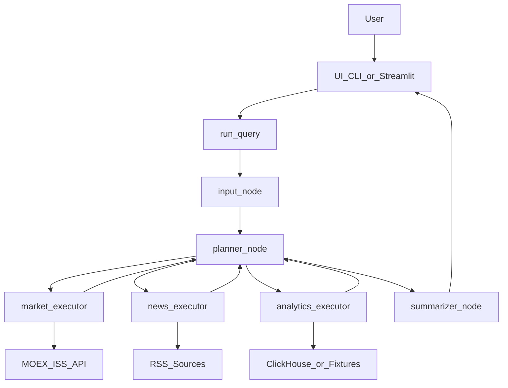
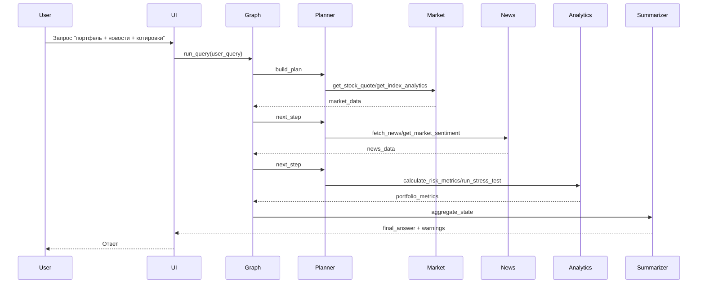

## Architecture And Data Flows

Документ описывает архитектуру Investment Assistant и потоки данных между слоями.

### 1. Слои системы

- **UI Layer**: `ui/cli.py`, `ui/streamlit_app.py`
- **Orchestrator Layer**: `orchestrator/graph.py`, `orchestrator/nodes/*`, `orchestrator/state.py`
- **MCP Server Layer**:
  - `servers/market_server/server.py`
  - `servers/news_server/server.py`
  - `servers/analytics_server/server.py`
- **Data Sources / Storage**:
  - MOEX ISS API (рыночные данные)
  - RSS-источники (новости)
  - ClickHouse / mock fixtures (портфель и аналитика)

### 2. Основной поток обработки запроса

1. Пользователь отправляет запрос через CLI или Streamlit.
2. UI вызывает `orchestrator.graph.run_query(...)`.
3. Граф проходит узлы:
   - `input` -> `planner` -> `market/news/analytics executor` -> `planner` (повторно) -> `summarizer`.
4. Исполнители вызывают MCP-инструменты серверов через `orchestrator.mcp_client`.
5. Итоговое состояние агрегируется в `summarizer`, формируется `final_answer`.
6. Ответ и предупреждения возвращаются в UI.

### 3. Надежность и деградация

- Planner ограничен `max_recursion` и `max_error_count`.
- В executor-узлах используются allowlist-инструментов.
- `market_executor` применяет retry для временных ошибок.
- `news_executor` и `analytics_executor` имеют degrade/fallback-ветки.
- Summarizer санитизирует недоверенный текст (`<`, `>`, `{`, `}`).

### 4. Mermaid-диаграмма потоков

### 5. Последовательность комплексного запроса

