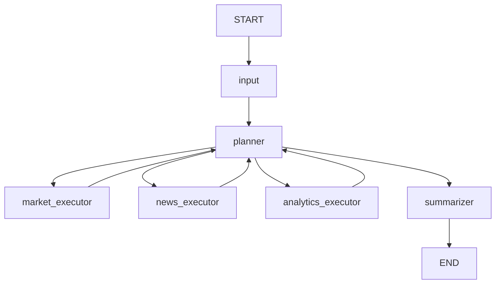

## LangGraph State Flow

Документ описывает структуру состояния и переходы узлов оркестратора.

Источник: `orchestrator/state.py`, `orchestrator/graph.py`, `orchestrator/nodes/*`.

## 1) Ключевые поля `InvestmentAssistantState`

- `user_query`: исходный запрос пользователя.
- `query_type`: `market_monitor | news_analysis | risk_assessment | portfolio_holdings | complex`.
- `extracted_tickers`: список тикеров, выделенных на входе.
- `plan`: план шагов выполнения (`PlanStep[]`).
- `current_step`: индекс текущего шага плана.
- `market_data`: агрегированные ответы market инструментов.
- `news_data`: агрегированные новости/новостные сигналы.
- `portfolio_metrics`: результаты analytics инструментов.
- `warnings`: предупреждения и сигналы деградации.
- `error_count`: количество ошибок по ходу выполнения.
- `final_answer`: итоговый ответ пользователю.
- `next_node`: целевой узел маршрутизации.
- `messages`: внутренние сообщения графа.
- `llm_plan_used` / `llm_plan_parse_failed`: диагностические флаги источника плана.
- `plan_contract_ok` / `plan_repaired`: результат contract-check и soft-repair плана.
- `routing_failure_reason`: краткая причина деградации маршрутизации (если была).

## 2) Жизненный цикл запроса

1. **`input_node`**:
   - валидирует `user_query` (не пустой, <=2000 символов);
   - извлекает тикеры;
   - определяет `query_type`.
2. **`planner_node`**:
   - формирует план (LLM или fallback);
   - выбирает `next_node` по текущему шагу;
   - завершает в `summarizer` при превышении лимитов/окончании плана.
3. **`*_executor`**:
   - выполняет разрешенный инструмент;
   - обновляет соответствующий фрагмент state;
   - увеличивает `current_step`;
   - при ошибках обновляет `error_count`, при необходимости формирует `warnings`.
4. **`summarizer_node`**:
   - собирает накопленные данные;
   - санитизирует недоверенные новости;
   - формирует `final_answer`.

## 3) Safe-degradation правила

- Planner завершает выполнение при `error_count >= max_error_count`.
- `news_executor` при накоплении ошибок добавляет предупреждение и продолжает без части новостей.
- `analytics_executor` при ошибке `calculate_risk_metrics` пытается fallback на `get_portfolio_summary`.
- `market_executor` выполняет retry (до 3 попыток) для временных сбоев.
- Все executor-узлы используют allowlist инструментов и отклоняют неизвестные вызовы.

## 4) Диаграмма переходов

## 5) Метрики качества на уровне `run_query`

После завершения графа добавляются поля метрик качества в `output_state["quality_metrics"]`:

- `scenario_success`
- `tool_selection_correct`
- `tool_selection_correct_full_plan`
- `response_time_sec`
- `mcp_calls_count`
- `error_count_final`
- `llm_plan_used`
- `llm_plan_parse_failed`
- `plan_contract_ok`
- `plan_repaired`
- `routing_failure_reason`

При включенном `QUALITY_METRICS_ENABLE_FILE=true` метрики также пишутся в JSONL.
