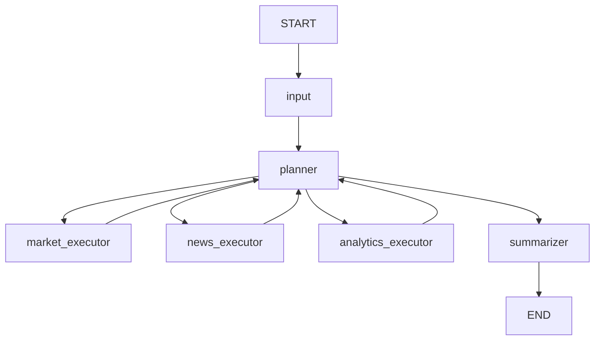

## LangGraph State Flow

Документ описывает структуру состояния и переходы узлов оркестратора.

Источник: `orchestrator/state.py`, `orchestrator/graph.py`, `orchestrator/nodes/*`.

## 1) Ключевые поля `InvestmentAssistantState`

- `user_query`: исходный запрос пользователя.
- `query_type`: `market_monitor | news_analysis | risk_assessment | portfolio_holdings | complex`.
- `extracted_tickers`: список тикеров, выделенных на входе.
- `investment_decision_intent`: флаг, что пользователь просит прямой совет купить/продать, а не только аналитику.
- `answer_depth`: желаемая глубина итогового ответа (`compact | standard`), может задаваться UI или вычисляться автоматически.
- `plan`: план шагов выполнения (`PlanStep[]`).
- `current_step`: индекс текущего шага плана.
- `market_data`: агрегированные ответы market инструментов.
- `news_data`: агрегированные новости/новостные сигналы.
- `portfolio_metrics`: результаты analytics инструментов.
- `warnings`: предупреждения и сигналы деградации.
- `error_count`: количество ошибок по ходу выполнения.
- `final_answer`: итоговый ответ пользователю.
- `next_node`: целевой узел маршрутизации.
- `messages`: внутренние сообщения графа.
- `llm_plan_used` / `llm_plan_parse_failed`: диагностические флаги источника плана.
- `plan_contract_ok` / `plan_repaired`: результат contract-check и soft-repair плана.
- `routing_failure_reason`: краткая причина деградации маршрутизации (если была).

## 2) Жизненный цикл запроса

1. **`input_node`**:
   - валидирует `user_query` (не пустой, <=2000 символов);
   - извлекает тикеры и company-to-ticker hints;
   - определяет `query_type`;
   - распознает stress intent по паттернам падения/шока, а не по одному слову `%`;
   - различает `portfolio_holdings`, `risk_assessment` и `complex`;
   - отдельно выставляет `investment_decision_intent`, если пользователь просит прямую рекомендацию;
   - вычисляет hints для sector stress, если пользователь спрашивает про отрасль (`финансы`, `нефтегаз` и т.д.).
2. **`planner_node`**:
   - сначала пытается построить план через LLM;
   - если LLM не вернул корректный JSON или вернул семантически слабый план, использует deterministic fallback;
   - нормализует аргументы шагов (`portfolio_id`, index aliases, magnitude, news query);
   - проверяет план на минимальный контракт по `query_type`;
   - при необходимости выполняет soft-repair плана fallback-версией;
   - сохраняет диагностические флаги `llm_plan_used`, `llm_plan_parse_failed`, `plan_contract_ok`, `plan_repaired`, `routing_failure_reason`;
   - выбирает `next_node` по текущему шагу;
   - завершает в `summarizer` при превышении лимитов/окончании плана.
3. **`*_executor`**:
   - выполняет разрешенный инструмент;
   - обновляет соответствующий фрагмент state;
   - увеличивает `current_step`;
   - при ошибках обновляет `error_count`, при необходимости формирует `warnings`.
4. **`summarizer_node`**:
   - собирает накопленные данные;
   - санитизирует недоверенные новости;
   - не вызывает LLM в рантайме, а собирает ответ детерминированно по шаблонам;
   - выбирает сценарий форматирования и глубину ответа (`compact`/`standard`);
   - для complex-ответов группирует блок "Основные показатели" по подзаголовкам;
   - учитывает `investment_decision_intent` и не превращает ответ в прямую инвестиционную рекомендацию;
   - формирует `final_answer`.

## 3) Safe-degradation правила

- Planner завершает выполнение при `error_count >= max_error_count`.
- Planner может заменить некачественный LLM-план fallback-планом еще до входа в executor-узлы.
- `news_executor` при накоплении ошибок добавляет предупреждение и продолжает без части новостей.
- `analytics_executor` при ошибке `calculate_risk_metrics` пытается fallback на `get_portfolio_summary`.
- `analytics_executor` дополнительно нормализует placeholder `portfolio_id` как fail-safe.
- `market_executor` выполняет retry (до 3 попыток) для временных сбоев.
- Все executor-узлы используют allowlist инструментов и отклоняют неизвестные вызовы.

## 4) Диаграмма переходов

## 5) Планирование: фактический flow

1. `input_node` классифицирует запрос и извлекает hints.
2. `planner_node` пытается получить JSON-план от LLM.
3. Если JSON не распарсился или структура неполная, строится fallback-план.
4. План проходит sanitize:
   - нормализация индексов (`MOEX` -> `IMOEX`);
   - нормализация `portfolio_id` (`<portfolio_id>` -> `demo_portfolio`, если пользователь не указал явный id);
   - коррекция `magnitude` и sector hints для stress-тестов;
   - безопасная нормализация аргументов news/market/analytics инструментов.
5. План проходит contract-check относительно `query_type`.
6. Если контракт нарушен, planner выполняет soft-repair fallback-планом и фиксирует причину в диагностике.
7. Только после этого план уходит в executor-ветку.

## 6) Метрики качества на уровне `run_query`

После завершения графа добавляются поля метрик качества в `output_state["quality_metrics"]`:

- `scenario_success`
- `tool_selection_correct`
- `expected_servers`
- `planned_servers`
- `observed_servers`
- `tool_selection_correct_full_plan`
- `response_time_sec`
- `mcp_calls_count`
- `error_count_final`
- `llm_plan_used`
- `llm_plan_parse_failed`
- `plan_contract_ok`
- `plan_repaired`
- `routing_failure_reason`

При включенном `QUALITY_METRICS_ENABLE_FILE=true` метрики также пишутся в JSONL.
